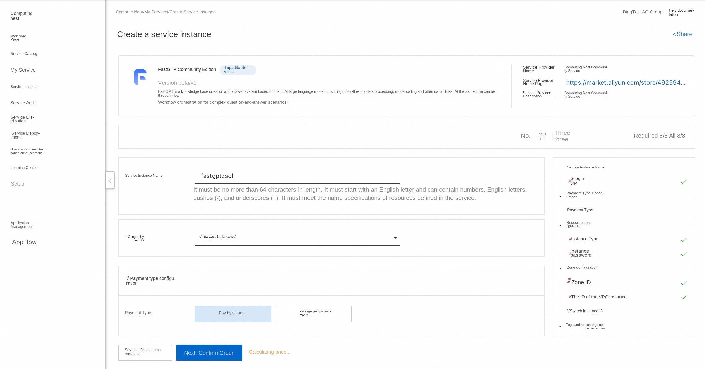
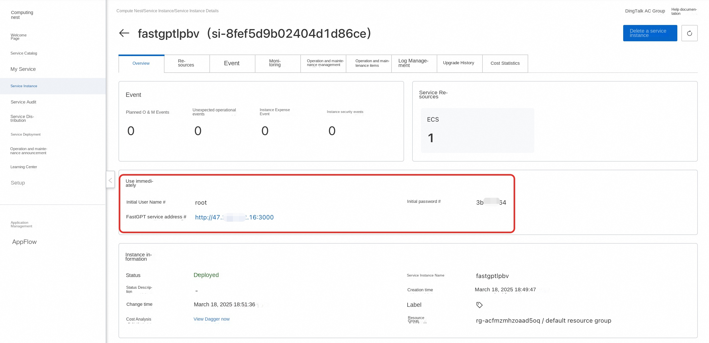
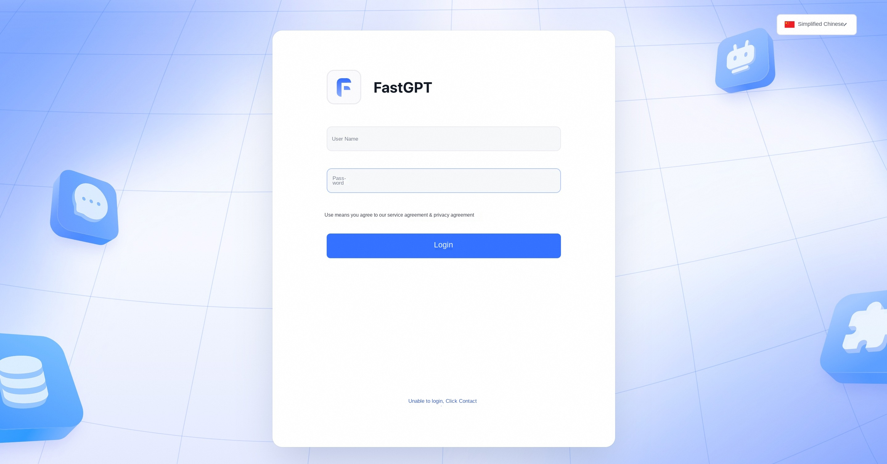
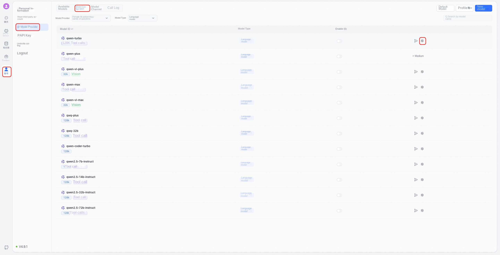
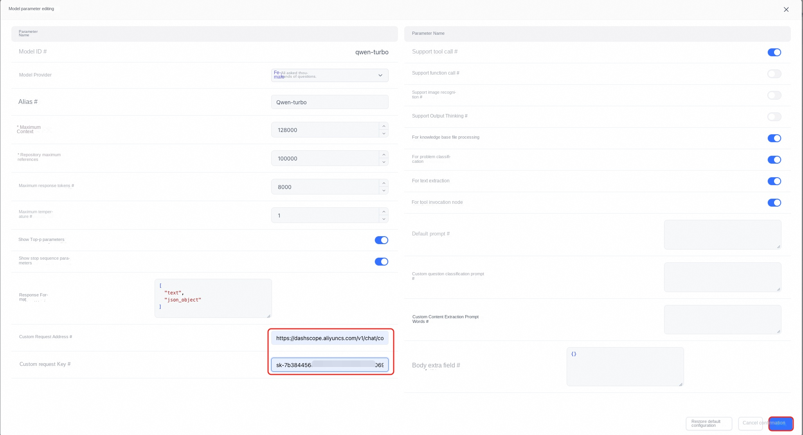
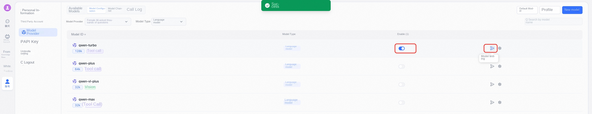

## Prerequisites

To deploy the FastGPT Community Edition service instance, you need to access and create some Alibaba Cloud resources. Therefore, your account must contain permissions for the following resources.
**Note**: This permission is required only when your account is a RAM account.

| Permission policy name | Comment |
| ------------------------------------- | ------------------------ |
| AliyunECSFullAccess | Permissions to manage ECS instances |
| AliyunVPCFullAccess | Permissions to manage a VPC |
| AliyunROSFullAccess | Manage permissions for Resource Orchestration Service (ROS) |
| AliyunComputeNestUserFullAccess | Manage user-side permissions for the compute nest service (ComputeNest) |

## Billing Description

The cost of FastGPT Community Edition deployment in Computing Nest mainly involves:

-Selected vCPU and memory specifications
-System disk type and capacity
-public network bandwidth

## Deployment process

1. Visit the Computing Nest FastGPT Community Edition [Deployment Link](https://computenest.console.aliyun.com/service/instance/create/cn-hangzhou?type=user&ServiceName=FastGTP社区版) and fill in the deployment parameters as prompted:

2. After completing the parameters, you can see the corresponding RFQ details. After confirming the parameters, click **Next: Confirm Order**.

3. Confirm that the order is complete and agree to the service agreement and click **Create Now** to enter the deployment phase.

4. After the deployment is completed, you can start using the service. Enter the service instance details and click the service address.

5. After loading, you can log in to use FastGPT services.

6. Select the model:

7. Configure the request address and APIKey for the model:

Request address: https://dashscope.aliyuncs.com/compatible-mode/v1/chat/completions

8. After saving click Enable and test:

9. After the test is successful, the model can be used normally.

# Instructions for use
For more usage, please refer to the FastGpt [official website document](https://doc.tryfastgpt.ai/docs/intro/).